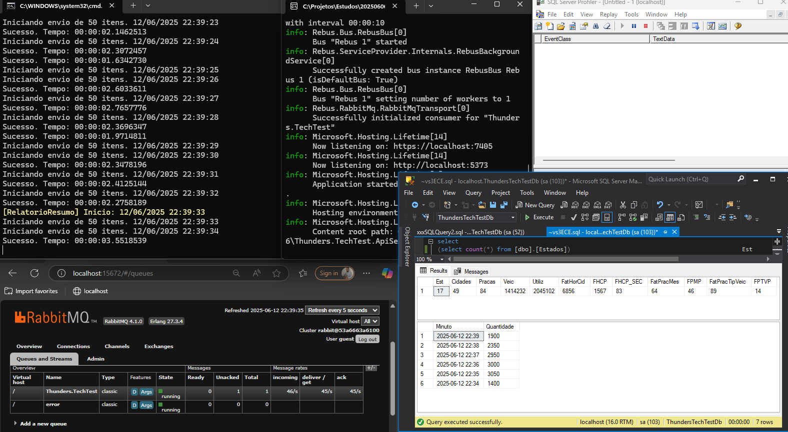
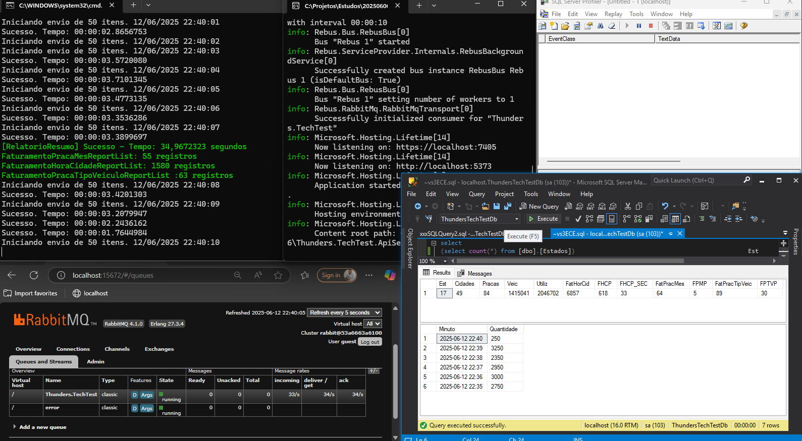

# Introdução  

Bem-vindo ao teste técnico da Thunders! 🚀 

Estamos empolgados por você estar participando deste desafio e animados para conhecer melhor suas habilidades e seu potencial. Aproveite este momento para demonstrar sua criatividade, conhecimento técnico e capacidade de resolver problemas. 

Lembre-se: você não está sozinho nessa jornada! Caso tenha qualquer dúvida ou precise de suporte, sinta-se à vontade para entrar em contato com o nosso time. Estamos aqui para ajudar e garantir que você tenha a melhor experiência possível. 

Boa sorte e mãos à obra! Estamos ansiosos para ver o que você pode criar. 

# Requisitos Funcionais 

O governo anunciou a abertura de uma licitação para o desenvolvimento e implementação de um sistema informatizado voltado à geração de relatórios detalhados de faturamento das unidades de pedágio do país. Como vencedor dessa licitação, você será responsável por projetar e implementar uma solução eficiente e escalável, 
capaz de receber dados sobre as utilizações de cada unidade e consolidá-los em um relatório no formato especificado pelo edital. De acordo com informações do UOL, o Brasil conta com mais de 1.800 praças de pedágio distribuídas pelas 27 unidades federativas, o que evidencia a magnitude e a importância do projeto. Este software deverá não apenas atender aos requisitos técnicos, 
mas também ser capaz de lidar como grande volume de dados gerado diariamente, garantindo a precisão e a agilidade necessárias para a tomada de decisões administrativas e estratégicas. 

Os dados de utilização devem ser unitários e conter minimamente os atributos a seguir: 

- Data e hora de utilização 
- Praça 
- Cidade 
- Estado 
- Valor pago 
- Tipo de veículo (Moto, Carro ou Caminhão) 

 

Os relatórios a seguir foram solicitados: 

- Valor total por hora por cidade 
- As praças que mais faturaram por mês (a quantidade a ser processada deve ser configurável) 
- Quantos tipos de veículos passaram em uma determinada praça 

# Requisitos Técnicos 

 
A solução deve utilizar o template já estruturado disponível neste repositório, basta criar um fork ou clonar para começar.

- Toda implementação deve ser feita dentro do projeto ApiService encontrado no template. Recomenda-se não alterar o código dos outros projetos, porém, caso julgue necessário, alterações podem ser realizadas. 
- A solução deverá fornecer uma API para que as empresas dos pedágios possam enviar os dados.  
- O gatilho para processamento dos relatórios deve ser via API, simulando um agendamento. 
- Persistir os dados de utilização e os resultados dos relatórios. 
- O Timeout padrão é de 10 segundos e não pode ser alterado. 
- A solução utiliza .NET Aspire, então serviços externos como RabbitMQ, SQL Server e outros estão disponíveis de antemão. Para iniciar a aplicação basta manter o projeto AppHost como startup project. 
- Para facilitar o uso do broker a biblioteca Rebus está disponível, bastando apenas a criação de mensagens e seus respectivos “ouvintes”. 
- A implementação de testes para demonstrar o potencial da solução garantirá pontos extras. 
- A solução fornece suporte para OpenTelemetry 
- Considerar que milhões de registros serão ingeridos pela aplicação. 
- Os componentes existentes podem ser alterados, por exemplo SQL Server -> Postgres ou RabbitMQ -> Kafka. 
- Novos componentes podem ser agregados a solução, caso seja necessário.

 

Alguns componentes foram criados e disponibilizados para facilitar a implementação do teste: 

- Interface ‘IMessageSender’ do projeto OutOfBox: permite o envio de mensagens para o broker. 
- Features: para habilitar o uso de Mensageria ou Entity Framework através do padrão de configurações do .NET 

# Resumo da implementação

Thunders.TechTest.ApiService
O Thunders.TechTest.ApiService é o serviço principal da solução, responsável por expor APIs para o gerenciamento e processamento de utilizações de pedágios. Ele implementa as regras de negócio, realiza a persistência dos dados, gera relatórios e integra com outros sistemas, como filas e cache, garantindo robustez e escalabilidade.
Destaques técnicos:
•	APIs para operações de pedágio: Permite o registro de utilizações, consulta de dados e geração de relatórios.
•	Migrations e versionamento do banco: Utiliza o Entity Framework Core para controlar a evolução do banco de dados por meio de migrations, facilitando a atualização e o versionamento do schema.
•	Índices para performance: Os principais campos utilizados em buscas, filtros e validações de unicidade (como a placa do veículo) possuem índices criados via migrations. Isso garante consultas mais rápidas e eficientes, mesmo com grandes volumes de dados.
•	Boas práticas de arquitetura: Uso de DTOs, repositórios, eventos e injeção de dependência para facilitar manutenção e testes.
Thunders.TechTest.Tests
O Thunders.TechTest.Tests é um projeto de testes e simulação de carga para a API. Ele automatiza o envio de requisições para os endpoints do serviço, tanto em lote quanto individualmente, além de acionar rotinas de processamento de relatórios em segundo plano.
Destaques técnicos:
•	Simulação de cenários reais: Gera dados variados e executa múltiplas requisições para validar o comportamento e a performance da API.
•	Medição de desempenho: Exibe resultados de sucesso, falha e tempo de resposta, auxiliando na identificação de gargalos.
•	Validação de robustez: Permite testar a aplicação sob carga, garantindo que os índices e otimizações do banco estejam realmente beneficiando a performance.
---
Migrations e Índices: Foco em Performance
O projeto utiliza migrations do Entity Framework Core para versionar e aplicar alterações no banco de dados de forma controlada e segura. Sempre que há mudanças no modelo de dados, uma nova migration é criada e aplicada, mantendo o histórico de evolução do schema.
Além disso, índices são criados em campos estratégicos, como a coluna Placa da tabela de veículos, para garantir buscas rápidas e validação eficiente de unicidade. O uso correto de índices é fundamental para manter a performance do sistema, especialmente em operações de leitura e consulta sob alta demanda.
---
Resumo
A combinação de uma API robusta, testes automatizados de carga e o uso de migrations e índices garante que a solução Thunders.TechTest seja confiável, escalável e com alta performance, pronta para ambientes de produção exigentes.
---

Entidades de Relatórios Agregados
Para otimizar o acesso e a performance dos relatórios, foram criadas três entidades específicas no banco de dados: FaturamentoHoraCidadeReport, FaturamentoPracaMesReport e FaturamentoPracaTipoVeiculoReport. Essas entidades armazenam os dados já agregados durante o processamento, permitindo consultas rápidas e eficientes, mesmo com grandes volumes de dados.
Objetivo
O objetivo dessas entidades é evitar a necessidade de realizar agregações complexas e custosas em tempo real sobre tabelas de utilização, especialmente considerando o alto volume de registros esperado no sistema. Ao persistir os resultados dos relatórios já processados, a aplicação garante respostas ágeis para as consultas dos usuários e para integrações externas.
Entidades Criadas
•	FaturamentoHoraCidadeReport:
Armazena o valor total faturado por hora em cada cidade, facilitando a geração de relatórios detalhados de faturamento horário.
•	FaturamentoPracaMesReport:
Guarda o faturamento mensal de cada praça, permitindo identificar rapidamente as praças que mais faturaram em cada período.
•	FaturamentoPracaTipoVeiculoReport:
Registra a quantidade de veículos por tipo que passaram em cada praça, otimizando a consulta sobre o fluxo de diferentes tipos de veículos.
Benefícios
•	Performance: Consultas aos relatórios são realizadas diretamente sobre tabelas agregadas, reduzindo drasticamente o tempo de resposta.
•	Escalabilidade: O sistema suporta grandes volumes de dados sem perda de desempenho nas consultas.
•	Simplicidade: A lógica de agregação é centralizada no processamento, mantendo as consultas simples e eficientes.
---
Essas entidades são fundamentais para garantir que o sistema atenda aos requisitos de performance e escalabilidade exigidos pelo projeto.

